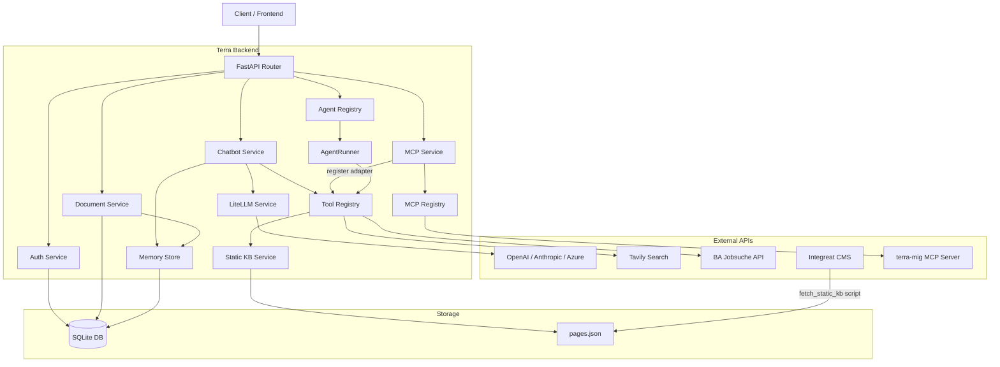
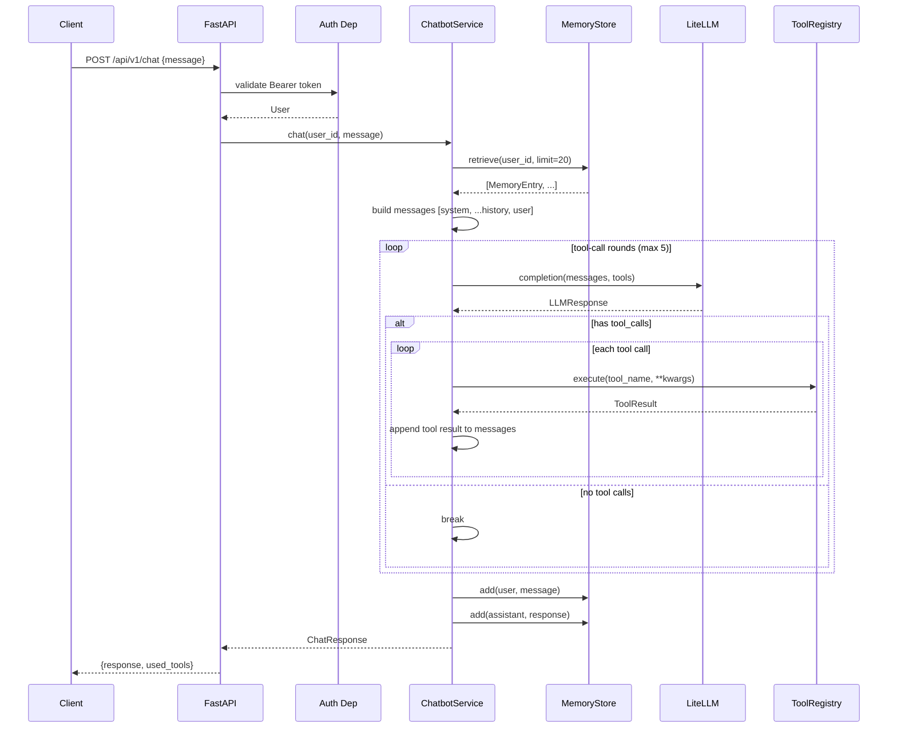
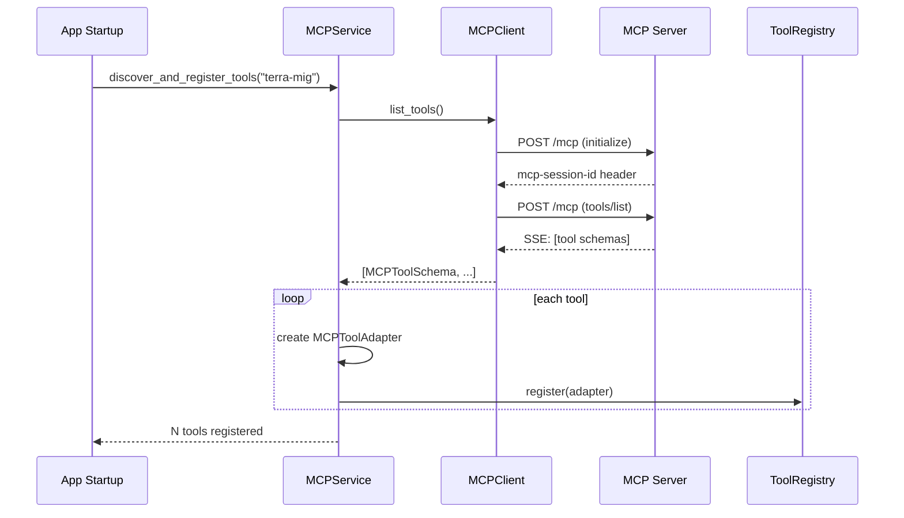
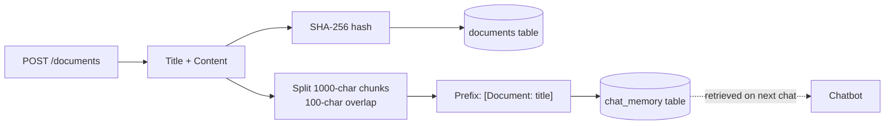
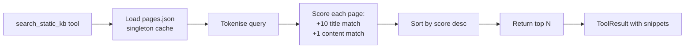
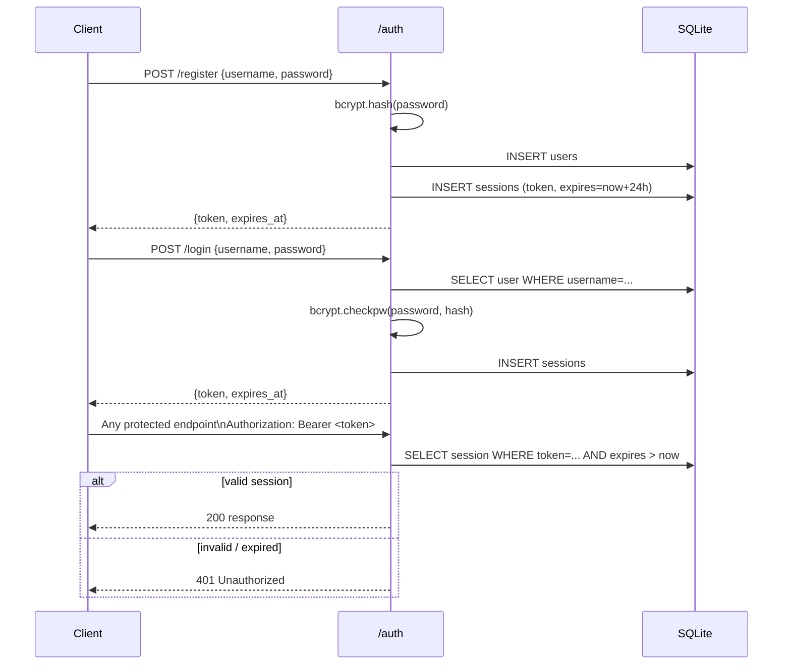
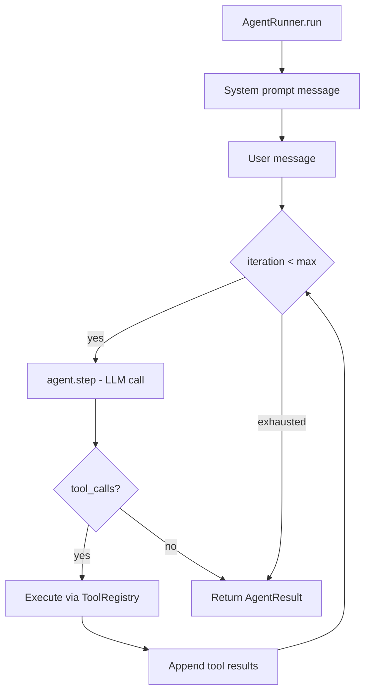
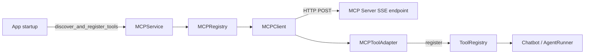
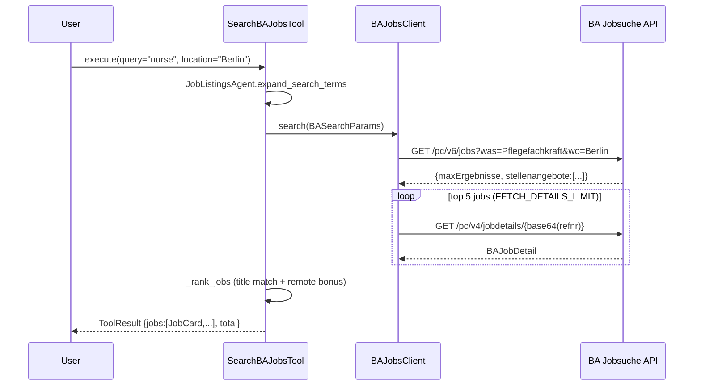
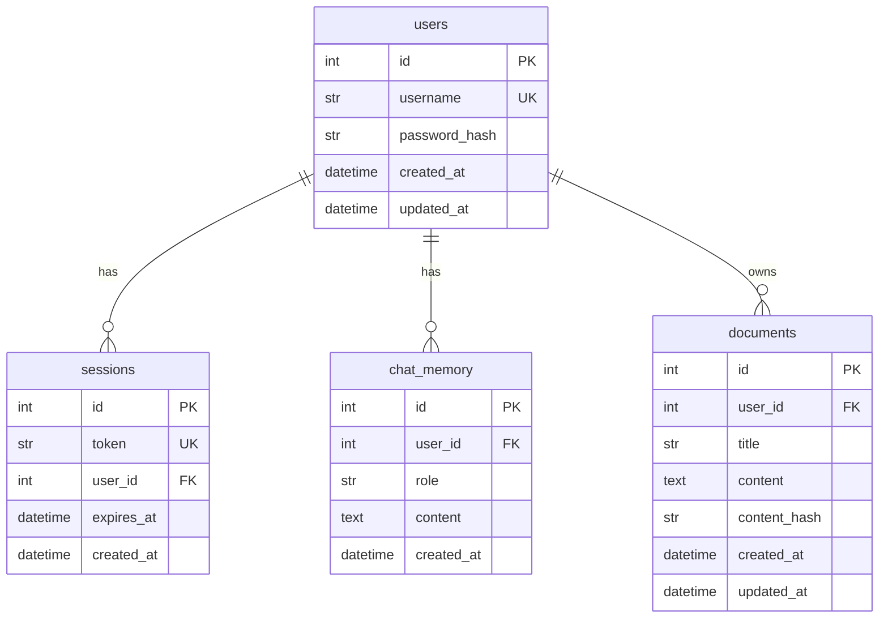

# Terra Backend

AI-powered assistant backend for migrants and newcomers to Germany. Terra provides conversational AI with long-term memory, automatic tool calling, German job search, integration knowledge, real-time web search, and MCP server integration — all through a clean REST API.

## Quick Start

```bash
# Prerequisites: Python 3.12+, uv (https://docs.astral.sh/uv/)
git clone https://github.com/terra-AI4Good/terra-backend && cd terra-backend

uv sync
cp .env.example .env
# Edit .env — at minimum set OPENAI_API_KEY

uv run uvicorn terra.main:app --reload
```

```bash
curl http://localhost:8000/health
# {"status": "healthy"}
```

---

## Table of Contents

1. [Project Overview](#1-project-overview)
2. [Features](#2-features)
3. [Architecture](#3-architecture)
4. [Project Structure](#4-project-structure)
5. [Technology Stack](#5-technology-stack)
6. [Installation](#6-installation)
7. [Configuration](#7-configuration)
8. [API Reference](#8-api-reference)
9. [Authentication](#9-authentication)
10. [Chatbot & Memory](#10-chatbot--memory)
11. [Tools](#11-tools)
12. [Agents](#12-agents)
13. [MCP Integration](#13-mcp-integration)
14. [Static Knowledge Base](#14-static-knowledge-base)
15. [BA Jobs Integration](#15-ba-jobs-integration)
16. [Database](#16-database)
17. [Testing](#17-testing)
18. [Development Workflow](#18-development-workflow)
19. [Extending the System](#19-extending-the-system)
20. [Future Improvements](#20-future-improvements)

Detailed references:
- [`docs/api.md`](docs/api.md) — full API documentation with request/response examples
- [`docs/architecture.md`](docs/architecture.md) — deep-dive architecture and diagrams
- [`docs/configuration.md`](docs/configuration.md) — every environment variable documented
- [`docs/extending.md`](docs/extending.md) — step-by-step extension guides
- [`docs/static_kb.md`](docs/static_kb.md) — knowledge base ingestion and refresh
- [`docs/testing.md`](docs/testing.md) — test structure, fixtures, mocking strategy
- [`docs/deployment.md`](docs/deployment.md) — Docker and production deployment

---

## 1. Project Overview

Terra is the backend for an AI assistant designed to help migrants navigate life in Germany. It combines a memory-backed conversational chatbot with specialised tools: German job search via the Bundesagentur für Arbeit API, a static integration knowledge base sourced from Integreat CMS, real-time web search via Tavily, and visa/migration data from a remote MCP server.

**Goals:**
- Provide context-aware AI assistance that remembers users across sessions
- Surface relevant German integration resources without requiring users to know where to look
- Support multiple LLM providers through a single abstraction
- Be extensible: new tools, agents, and knowledge sources can be added with minimal friction

**Core capabilities:**
- Session-authenticated REST API (FastAPI)
- Chatbot with persistent per-user memory and automatic tool calling
- Document ingestion — users upload text; it is chunked and integrated into memory
- Job search — BA Jobsuche API with English-to-German term expansion and ranking
- Integration knowledge — 616 Integreat CMS pages searched by keyword
- Web search — Tavily-powered live search
- MCP client — consumes tools from remote Model Context Protocol servers
- Pluggable agent framework with an execution runner and lifecycle hooks

---

## 2. Features

### 2.1 Authentication

Session-based authentication. Passwords are hashed with bcrypt. Each login issues a 64-character hex token valid for 24 hours. All protected endpoints read the token from `Authorization: Bearer <token>`.

### 2.2 Chatbot

Single-turn endpoint (`POST /api/v1/chat`). The service:
1. Retrieves the user's recent conversation history from the memory store (up to 20 entries).
2. Builds a message list: `[system, ...memory, user_message]`.
3. Calls the LLM (via LiteLLM) with all registered tool schemas.
4. Runs a tool-call loop (max 5 rounds): if the model requests tools, executes them and feeds results back.
5. Stores both the user message and the final assistant reply in memory.
6. Returns the response and the list of tools used.

### 2.3 Memory System

Per-user conversation history stored in SQLite. Implemented behind a `MemoryStore` abstract interface so any backend (vector DB, Mem0, etc.) can replace it without touching the chatbot logic. Current implementation is recency-based: the most recent N turns are fetched. Document chunks are stored in the same table tagged with source metadata.

### 2.4 Document Uploads

Users upload plain-text documents via `POST /api/v1/documents`. Each document is:
- Persisted to the `documents` table (title, content, SHA-256 hash)
- Split into overlapping 1000-character chunks (100-character overlap)
- Each chunk stored as a memory entry prefixed `[Document: <title>]`

The chatbot retrieves document content automatically when relevant.

### 2.5 Static Knowledge Base

616 pages from the Integreat CMS covering 13 German integration topic categories. Pages are pre-processed (HTML stripped, content normalised) and stored in `data/static_kb/processed/pages.json`. Search is keyword-based with title/content scoring.

### 2.6 Web Search

Tavily-powered web search exposed as the `web_search` tool. Supports `basic` and `advanced` depth, configurable result counts, domain filtering, and optional AI-generated answer summaries.

### 2.7 BA Jobs Integration

Two tools — `search_ba_jobs` and `get_ba_job_details` — wrap the BA Jobsuche REST API. The `JobListingsAgent` adds English-to-German term expansion and a scoring-based ranking step.

### 2.8 MCP Integration

Terra implements a Model Context Protocol (MCP) client using the Streamable HTTP (SSE) transport. At startup it connects to configured MCP servers, discovers their tools, and registers each as a native `Tool` via `MCPToolAdapter`. MCP tools are transparently available to the chatbot and agents alongside built-in tools.

### 2.9 Agent Orchestration

The `AgentRunner` manages the LLM-tool loop for agents: builds the message context, calls `agent.step()` in a loop, dispatches tool calls through the `ToolRegistry`, and feeds results back until the model produces a final answer or `max_iterations` is reached. `ExecutionHook` callbacks fire at each lifecycle point for logging, tracing, or evaluation.

### 2.10 Tool System

All capabilities are implemented as `Tool` subclasses with a `ToolDefinition` (name, description, parameter schema) and an async `execute` method. The `ToolRegistry` holds all instances and generates OpenAI-compatible JSON schemas for the LLM.

---

## 3. Architecture

### 3.1 System Overview



### 3.2 Request Lifecycle (Chat)



### 3.3 MCP Tool Discovery (Startup)



### 3.4 Document Ingestion



### 3.5 Static KB Retrieval



---

## 4. Project Structure

```
terra-backend/
├── src/terra/                   # Application source
│   ├── main.py                  # Entrypoint: creates the FastAPI app instance
│   ├── app.py                   # App factory, lifespan, CORS middleware
│   ├── config.py                # Pydantic Settings — all env vars, cached singleton
│   ├── setup.py                 # Registers tools, agents, MCP servers at startup
│   │
│   ├── api/                     # HTTP layer
│   │   ├── router.py            # Top-level router (/health + /api/v1)
│   │   ├── deps.py              # FastAPI dependencies: get_db, get_current_user
│   │   └── v1/endpoints/
│   │       ├── auth.py          # /auth/register, /login, /logout, /me
│   │       ├── chatbot.py       # /chat
│   │       ├── documents.py     # /documents CRUD
│   │       ├── agents.py        # /agents, /tools, /agents/run
│   │       ├── mcp.py           # /mcp/servers, health, tools, call
│   │       └── health.py        # /health
│   │
│   ├── services/                # Business logic
│   │   ├── auth.py              # Registration, login, session management
│   │   ├── chatbot.py           # ChatbotService: memory + LLM + tool loop
│   │   ├── documents.py         # Document CRUD + chunked memory indexing
│   │   ├── ba_jobs_client.py    # HTTP client for BA Jobsuche API
│   │   ├── static_kb.py         # StaticKBService: load, search, retrieve pages
│   │   └── search/
│   │       ├── base.py          # SearchProvider ABC
│   │       └── tavily.py        # TavilySearchProvider implementation
│   │
│   ├── tools/                   # Tool implementations
│   │   ├── base.py              # Tool ABC, ToolDefinition, ToolResult, ToolParameter
│   │   ├── registry.py          # ToolRegistry (global singleton: tool_registry)
│   │   ├── search.py            # WebSearchTool
│   │   ├── ba_jobs.py           # SearchBAJobsTool, GetBAJobDetailsTool
│   │   ├── static_kb.py         # SearchStaticKBTool, GetStaticKBItemTool, ListStaticKBCategoriesTool
│   │   ├── knowledge.py         # KnowledgeRetrievalTool (placeholder)
│   │   ├── browser.py           # WebBrowserTool (placeholder)
│   │   ├── custom_data.py       # CustomDataTool (placeholder)
│   │   └── database.py          # DatabaseQueryTool (placeholder)
│   │
│   ├── agents/                  # Agent implementations
│   │   ├── base.py              # Agent ABC, AgentConfig, AgentResult
│   │   ├── registry.py          # AgentRegistry (global singleton: agent_registry)
│   │   ├── search_agent.py      # SearchAgent
│   │   ├── job_listings.py      # JobListingsAgent (BA search + EN→DE expansion)
│   │   └── static_kb_agent.py   # StaticKnowledgeBaseAgent
│   │
│   ├── orchestration/           # Agent execution engine
│   │   ├── runner.py            # AgentRunner: the LLM-tool loop
│   │   └── hooks.py             # ExecutionHook ABC, NullHook, LoggingHook
│   │
│   ├── mcp/                     # MCP client subsystem
│   │   ├── schemas.py           # MCPServerConfig, MCPToolSchema, MCPToolCallResult
│   │   ├── registry.py          # MCPRegistry (global singleton: mcp_registry)
│   │   ├── client.py            # MCPClient: SSE transport, initialize, list_tools, call_tool
│   │   ├── service.py           # MCPService: discover, health-check, call
│   │   └── tool_adapter.py      # MCPToolAdapter: wraps MCP tools as Terra Tools
│   │
│   ├── llm/                     # LLM abstraction
│   │   ├── config.py            # ModelConfig, LLMSettings
│   │   ├── service.py           # LLMService (LiteLLM async wrapper)
│   │   └── types.py             # ChatMessage, ToolCall, FunctionCall, LLMResponse
│   │
│   ├── memory/                  # Memory subsystem
│   │   ├── base.py              # MemoryStore ABC, MemoryEntry
│   │   └── db_store.py          # DatabaseMemoryStore (recency-based SQLite)
│   │
│   ├── models/                  # SQLAlchemy ORM models
│   │   ├── user.py              # User
│   │   ├── session.py           # Session
│   │   ├── memory.py            # ChatMemory
│   │   └── document.py          # Document
│   │
│   ├── schemas/                 # Pydantic schemas for external APIs
│   │   └── jobs.py              # BASearchParams, BAJobSummary, BAJobDetail, JobCard
│   │
│   ├── db/                      # Database configuration
│   │   ├── base.py              # DeclarativeBase + MappedAsDataclass
│   │   ├── session.py           # Engine + async_session_factory
│   │   └── migrations/env.py    # Alembic async migration runner
│   │
│   ├── prompts/
│   │   └── base.py              # PromptTemplate (string.Template wrapper)
│   │
│   ├── scripts/
│   │   └── fetch_static_kb.py   # Fetches + processes Integreat KB pages
│   │
│   └── evals/
│       └── base.py              # Evaluation harness (placeholder)
│
├── tests/                       # Test suite
│   ├── conftest.py              # Fixtures: in-memory DB, test app, async HTTP client
│   ├── test_auth.py
│   ├── test_chatbot.py
│   ├── test_documents.py
│   ├── test_ba_jobs.py
│   ├── test_static_kb.py
│   ├── test_tools.py
│   ├── test_agents.py
│   ├── test_agents_api.py
│   ├── test_mcp.py
│   ├── test_llm.py
│   ├── test_web_search.py
│   └── test_health.py
│
├── data/
│   └── static_kb/
│       ├── raw/payload.json         # Raw Integreat API response (cached)
│       └── processed/pages.json     # Normalised, searchable pages (616 entries)
│
├── docs/                        # Detailed documentation
│   ├── api.md                   # Full API reference with examples
│   ├── architecture.md          # System design and component diagrams
│   ├── configuration.md         # All environment variables
│   ├── deployment.md            # Docker and production deployment
│   ├── extending.md             # How to add tools, agents, MCP servers
│   ├── static_kb.md             # KB ingestion pipeline details
│   └── testing.md               # Test structure and mocking strategy
│
├── Dockerfile
├── docker-compose.yml
├── docker-entrypoint.sh
├── alembic.ini
├── pyproject.toml
└── .env.example
```

---

## 5. Technology Stack

| Dependency | Version | Purpose |
|---|---|---|
| **FastAPI** | ≥0.115 | Async HTTP framework with automatic OpenAPI docs |
| **uvicorn** | ≥0.34 | ASGI server |
| **LiteLLM** | ≥1.60 | Unified interface for OpenAI, Anthropic, Azure, and 100+ LLM providers |
| **SQLAlchemy** | ≥2.0 | Async ORM with `MappedAsDataclass` for type-safe models |
| **aiosqlite** | ≥0.21 | Async SQLite driver |
| **Alembic** | ≥1.14 | Schema migrations (async-aware) |
| **Pydantic** | ≥2.10 | Data validation and settings management |
| **pydantic-settings** | ≥2.7 | Environment-variable-backed `Settings` class |
| **bcrypt** | ≥4.2 | Password hashing |
| **httpx** | ≥0.28 | Async HTTP client for BA API and MCP transport |
| **tavily-python** | ≥0.5 | Official Tavily async client |
| **uv** | latest | Fast package manager with lockfile |
| **ruff** | ≥0.11 | Linting and formatting |
| **mypy** | ≥1.14 | Static type checking (strict mode) |
| **pytest** | ≥8.3 | Test runner |
| **pytest-asyncio** | ≥0.25 | Async test support |
| **pytest-cov** | ≥6.0 | Coverage (80% minimum) |
| **pre-commit** | ≥4.0 | Git hook runner |

**Why LiteLLM?** One `acompletion()` call works across all major LLM providers. Switching from GPT-4o to Claude is a single config change.

**Why SQLite?** Simplicity at current scale. The `aiosqlite` driver is non-blocking. The `MemoryStore` abstraction makes it trivial to swap for PostgreSQL or a vector database.

**Why uv?** Significantly faster than pip. The `uv.lock` lockfile guarantees reproducible installs.

---

## 6. Installation

### Prerequisites

- Python 3.12+
- [uv](https://docs.astral.sh/uv/) — install with `curl -LsSf https://astral.sh/uv/install.sh | sh`

### Setup

```bash
# 1. Clone
git clone https://github.com/terra-AI4Good/terra-backend && cd terra-backend

# 2. Install all dependencies (creates .venv automatically)
uv sync

# Development tools (pytest, ruff, mypy, pre-commit):
uv sync --all-extras

# 3. Configure
cp .env.example .env
# At minimum, set:
#   OPENAI_API_KEY=sk-...        (or ANTHROPIC_API_KEY for Claude)
#   TAVILY_API_KEY=tvly-...      (for web search)
#   SECRET_KEY=<random string>   (in production)
```

### Database

The database is initialised automatically on first startup (`create_all`). For schema migrations:

```bash
uv run alembic revision --autogenerate -m "describe change"
uv run alembic upgrade head
```

### Static Knowledge Base

The KB is bundled in `data/static_kb/processed/pages.json`. To refresh from Integreat CMS:

```bash
uv run python -m terra.scripts.fetch_static_kb
```

### Running Locally

```bash
uv run uvicorn terra.main:app --reload
# Server: http://localhost:8000
# Swagger UI: http://localhost:8000/docs
```

### Running Tests

```bash
uv run pytest
uv run pytest --cov=src/terra --cov-report=term-missing
```

### Docker

```bash
docker compose up --build
```

See [`docs/deployment.md`](docs/deployment.md) for production details.

---

## 7. Configuration

All configuration is via environment variables or a `.env` file. See [`docs/configuration.md`](docs/configuration.md) for the complete reference.

**Minimum required:**

| Variable | Description |
|---|---|
| `OPENAI_API_KEY` | Required when using any OpenAI model |
| `SECRET_KEY` | Change from default before any production deployment |

**Key settings:**

| Variable | Default | Description |
|---|---|---|
| `LLM_DEFAULT_MODEL` | `gpt-4o-mini` | LiteLLM model identifier |
| `DATABASE_URL` | `sqlite+aiosqlite:///terra.db` | Database connection string |
| `TAVILY_API_KEY` | — | Enables web search |
| `MCP_ENABLED` | `true` | Enable/disable MCP integration |
| `MEMORY_CONTEXT_LIMIT` | `20` | Max memory entries per chat turn |
| `DEBUG` | `false` | SQL echo + memory context in responses |
| `ALLOWED_ORIGINS` | `["http://localhost:3000"]` | CORS (JSON array) |

---

## 8. API Reference

Full documentation at [`docs/api.md`](docs/api.md). Interactive docs at `/docs` when the server is running.

### Endpoint Summary

| Method | Path | Auth | Description |
|---|---|---|---|
| GET | `/health` | No | Root health check |
| GET | `/api/v1/health` | No | v1 health check |
| POST | `/api/v1/auth/register` | No | Register user, get token |
| POST | `/api/v1/auth/login` | No | Login, get token |
| POST | `/api/v1/auth/logout` | Bearer | Invalidate session |
| GET | `/api/v1/auth/me` | Bearer | Current user info |
| POST | `/api/v1/chat` | Bearer | Send message, get AI response |
| POST | `/api/v1/documents` | Bearer | Upload plain-text document |
| GET | `/api/v1/documents` | Bearer | List user's documents |
| GET | `/api/v1/documents/{id}` | Bearer | Get document with content |
| DELETE | `/api/v1/documents/{id}` | Bearer | Delete document |
| GET | `/api/v1/agents` | No | List registered agents |
| GET | `/api/v1/tools` | No | List registered tools |
| POST | `/api/v1/agents/run` | No | Execute an agent directly |
| GET | `/api/v1/mcp/servers` | Bearer | List configured MCP servers |
| GET | `/api/v1/mcp/servers/{name}` | Bearer | Get server config |
| GET | `/api/v1/mcp/servers/{name}/health` | Bearer | Health check |
| GET | `/api/v1/mcp/servers/{name}/tools` | Bearer | List server tools |
| POST | `/api/v1/mcp/servers/{name}/call` | Bearer | Call a tool on the server |

### Quick Examples

```bash
# Register
curl -s -X POST http://localhost:8000/api/v1/auth/register \
  -H "Content-Type: application/json" \
  -d '{"username":"alice","password":"securepass"}' | jq .
# {"token":"<64-hex-chars>","expires_at":"2026-01-02T12:00:00+00:00"}

# Chat
curl -s -X POST http://localhost:8000/api/v1/chat \
  -H "Authorization: Bearer <token>" \
  -H "Content-Type: application/json" \
  -d '{"message":"What healthcare options are available for newcomers?"}' | jq .
# {"response":"...","used_tools":["search_static_kb"]}
```

---

## 9. Authentication

Session-based authentication using bcrypt + random tokens.



**Security properties:**
- Passwords: bcrypt with per-user salt. Never stored in plain text.
- Tokens: `secrets.token_hex(32)` — 256 bits of entropy.
- Expiry: 24 hours. Expired sessions are deleted on first access.
- Multiple sessions per user are allowed (each login creates a new one).

---

## 10. Chatbot & Memory

### ChatbotService

`ChatbotService` orchestrates a single conversation turn. It is constructed with an `LLMService`, a `MemoryStore`, and an optional `ToolRegistry`. The service is stateless — all state lives in the memory store and is retrieved per turn.

**System prompt (default):**
> "You are Terra, a helpful AI assistant. Answer the user's questions clearly and concisely. Use tools when they would help provide a better answer."

**Tool loop** — up to `max_tool_rounds=5` iterations. Each iteration:
1. Calls `LLMService.completion()` with the full message list and all tool schemas.
2. If the model requests tools, each is dispatched to `ToolRegistry.execute()`.
3. Tool results are appended as `role="tool"` messages.
4. If no tool calls are returned, the loop exits.

### Memory Store

The `MemoryStore` interface:

```python
class MemoryStore(ABC):
    async def add(self, user_id, role, content, metadata=None): ...
    async def retrieve(self, user_id, query=None, limit=20) -> list[MemoryEntry]: ...
    async def clear(self, user_id): ...
    async def count(self, user_id) -> int: ...
```

`DatabaseMemoryStore` (current):
- Each message is a `ChatMemory` row (`user_id`, `role`, `content`, `created_at`).
- `retrieve` fetches the N most recent rows, reversed to chronological order.
- The `query` parameter is accepted but ignored — retrieval is purely recency-based. The interface supports a `query` argument so a semantic-search backend is a drop-in replacement.
- Document chunks from uploads share the same table, tagged with `metadata.source="document"`.

---

## 11. Tools

All tools implement the `Tool` ABC:

```python
class Tool(ABC):
    @property
    @abstractmethod
    def definition(self) -> ToolDefinition: ...

    @abstractmethod
    async def execute(self, **kwargs) -> ToolResult: ...
```

`ToolDefinition.to_openai_schema()` converts the definition to OpenAI function-calling format.

### Active Tools

| Name | Class | Description |
|---|---|---|
| `web_search` | `WebSearchTool` | Tavily web search with depth, domain filtering, AI answer |
| `search_ba_jobs` | `SearchBAJobsTool` | BA Jobsuche search: keyword, location, filters |
| `get_ba_job_details` | `GetBAJobDetailsTool` | Full job detail by Referenznummer |
| `search_static_kb` | `SearchStaticKBTool` | Keyword search across Integreat pages |
| `get_static_kb_item` | `GetStaticKBItemTool` | Fetch page by ID |
| `list_static_kb_categories` | `ListStaticKBCategoriesTool` | List KB topic categories |
| `mcp_terra-mig_*` | `MCPToolAdapter` | Dynamically registered from MCP server at startup |

### Placeholder Tools

These are registered and visible to the LLM but return a `"not yet implemented"` message:

| Name | Purpose |
|---|---|
| `web_browse` | Fetch and extract web page content |
| `knowledge_retrieval` | Vector knowledge base search |
| `custom_data_lookup` | Internal data source query |
| `database_query` | Controlled database access for agents |

Placeholders define the intended interface for future implementation without breaking the tool registry.

---

## 12. Agents

Agents combine a system prompt, tool access, and execution logic. Each implements:

```python
class Agent(ABC):
    async def run(self, input_message, context=None) -> AgentResult: ...  # high-level
    async def step(self, messages) -> ChatMessage: ...                    # single LLM step
```

### Registered Agents

| Name | Class | Tools | Description |
|---|---|---|---|
| `web_search` | `SearchAgent` | `web_search` | Search and format results |
| `job_listings` | `JobListingsAgent` | `search_ba_jobs`, `get_ba_job_details` | BA search with EN→DE expansion and ranking |
| `static_knowledge_base` | `StaticKnowledgeBaseAgent` | `search_static_kb`, `get_static_kb_item`, `list_static_kb_categories` | Integreat KB Q&A |

### JobListingsAgent Detail

`run()` skips an LLM round for the search itself:
1. Expands the query via `TERM_EXPANSIONS` (e.g. `"nurse"` → `"Pflegefachkraft"`).
2. Calls `SearchBAJobsTool` directly.
3. Scores results: +10 per query term in title, +2 for remote/telework.
4. Formats a ranked job card list.

`step()` uses the LLM with the tool schema, enabling orchestrator-driven agentic loops.

### AgentRunner



### Execution Hooks

Implement `ExecutionHook` for observability:

```python
class ExecutionHook(ABC):
    async def on_start(agent_name, input_message): ...
    async def on_step(agent_name, iteration, message): ...
    async def on_tool_call(agent_name, tool_name, call_id): ...
    async def on_tool_result(agent_name, tool_name, result): ...
    async def on_complete(agent_name, result): ...
```

Provided: `NullHook` (no-op), `LoggingHook` (stdout). Custom hooks can add OpenTelemetry tracing, Langfuse integration, cost tracking, etc.

---

## 13. MCP Integration

Terra implements the [Model Context Protocol](https://modelcontextprotocol.io/) client side using the Streamable HTTP transport (JSON-RPC over SSE).



**Protocol flow:**
1. `MCPClient.initialize()` sends an `initialize` JSON-RPC request. The server returns an `mcp-session-id` response header. Terra sends a `notifications/initialized` notification.
2. `MCPClient.list_tools()` calls `tools/list`. The server returns tool schemas via SSE.
3. Each tool schema is wrapped in an `MCPToolAdapter` and registered in the `ToolRegistry`.
4. Tool names are prefixed: `mcp_{server}_{tool}` (e.g. `mcp_terra-mig_salary_info`).
5. Tool calls go through `MCPClient.call_tool()` → `tools/call` JSON-RPC → SSE response.

**terra-mig server** — provides visa routes, salary data, and migration-related information hosted on AWS ECS. Discovery is non-fatal: if the server is unreachable at startup, the app continues without those tools.

---

## 14. Static Knowledge Base

616 pages from [Integreat CMS](https://integreat-app.de/) across 13 categories for newcomers in Germany.

### Categories

| Slug | Topic |
|---|---|
| `alltag` | Everyday life |
| `angebote-für-frauen-und-mädchen` | Services for women and girls |
| `arbeit-ausbildung` | Work and training |
| `beratung-und-hilfe-4` | Advice and assistance |
| `frag-integreat` | Ask Integreat |
| `gesundheit` | Healthcare |
| `info-aufenthalt` | Residence information |
| `kinder-jugendliche-familie` | Children, youth, family |
| `kultur-freizeit-sport` | Culture, leisure, sport |
| `schule-studium-bildung` | School and education |
| `sprache` | Language |
| `willkommen` | Welcome |
| `wohnen` | Housing |

### Ingestion Pipeline


**Run `fetch_static_kb`:**
```bash
uv run python -m terra.scripts.fetch_static_kb
# or in Docker:
docker exec <container> fetch-kb
```

See [`docs/static_kb.md`](docs/static_kb.md) for details.

---

## 15. BA Jobs Integration



**Search parameters:**

| Parameter | API field | Values |
|---|---|---|
| `query` | `was` | Job title (German recommended) |
| `location` | `wo` | City/region |
| `radius_km` | `umkreis` | Default: 50 km |
| `job_type` | `angebotsart` | 1=job, 2=self-employment, 4=Ausbildung, 34=trainee |
| `work_time` | `arbeitszeit` | `vz`=full, `tz`=part, `ho`=remote, `mj`=minijob |
| `published_since_days` | `veroeffentlichtseit` | Default: 30 |

---

## 16. Database

### Schema



All models use `MappedAsDataclass` for type-annotated definitions. `chat_memory.user_id` and `chat_memory.created_at` are indexed. `documents.content_hash` (SHA-256) is indexed for deduplication detection.

### Migrations

```bash
uv run alembic revision --autogenerate -m "your description"
uv run alembic upgrade head
uv run alembic downgrade -1
```

---

## 17. Testing

See [`docs/testing.md`](docs/testing.md) for full details.

### Fixtures

| Fixture | Description |
|---|---|
| `db` | In-memory SQLite session; tables created/dropped per test |
| `app` | FastAPI app with `get_db` overridden to use test session |
| `client` | `httpx.AsyncClient` via `ASGITransport` |

All tests are async (`asyncio_mode = "auto"`). No real external services are called — LLM calls, Tavily, and BA API are mocked.

```bash
uv run pytest
uv run pytest --cov=src/terra --cov-report=term-missing
uv run pytest tests/test_auth.py -v
```

Coverage minimum: 80%.

---

## 18. Development Workflow

### Branching

- `main` — production-ready
- `develop` — integration branch
- `feature/<name>` — branch off `develop`

### Pre-commit

```bash
uv run pre-commit install
uv run pre-commit run --all-files
```

Hooks run `ruff check`, `ruff format`, and `mypy` on staged files.

### Daily Commands

```bash
uv run pytest                          # tests
uv run ruff check src/ tests/          # lint
uv run ruff format src/ tests/         # format
uv run mypy src/terra/                 # type check
uv run uvicorn terra.main:app --reload # dev server
```

---

## 19. Extending the System

See [`docs/extending.md`](docs/extending.md) for step-by-step guides.

### New Tool (Summary)

1. Create `src/terra/tools/my_tool.py` subclassing `Tool`.
2. Implement `definition` (returns `ToolDefinition`) and `async execute(**kwargs)`.
3. Register in `setup.py` → `_register_tools()`.

### New Agent (Summary)

1. Create `src/terra/agents/my_agent.py` subclassing `Agent`.
2. Implement `run()` and `step()`.
3. Register in `setup.py` → `_register_agents()` with `AgentConfig`.

### New MCP Server (Summary)

1. Add `MCPServerConfig` in `setup.py` → `_register_mcp_servers()`.
2. Add env vars in `config.py` and `.env.example`.
3. Tools discovered automatically at startup.

### New LLM Provider (Summary)

Set `LLM_DEFAULT_MODEL` to any [LiteLLM-supported identifier](https://docs.litellm.ai/docs/providers) and provide the provider API key. No code changes needed.

### New Memory Backend (Summary)

Subclass `MemoryStore`, implement `add`/`retrieve`/`clear`/`count`, and swap instantiation in `chatbot.py`.

---

## 20. Future Improvements

| Area | Description |
|---|---|
| **Streaming responses** | LiteLLM streaming + FastAPI `StreamingResponse` for real-time output |
| **Multiple conversations** | `conversations` table; scope memory to conversation, not user |
| **Vector memory** | Replace recency retrieval with semantic search (pgvector, Qdrant, Chroma) |
| **Evaluation framework** | Implement `evals/base.py`; LLM-as-judge scoring |
| **Observability** | OpenTelemetry in `ExecutionHook`; export to Langfuse or Honeycomb |
| **Caching** | Cache tool results and LLM responses for identical inputs |
| **Rate limiting** | Per-user token/request limits |
| **Role-based auth** | Admin role for KB refresh and user management |
| **PostgreSQL** | Minimal code change via SQLAlchemy; needed for horizontal scaling |
| **Redis sessions** | Shared session store for multi-worker deployments |
| **KB vector indexing** | Embed Integreat pages for semantic retrieval |
| **MCP auth** | OAuth2/API-key support via `MCPServerConfig.auth_headers` |
| **Streaming tool results** | Surface intermediate tool output during long agent runs |

## License

MIT
