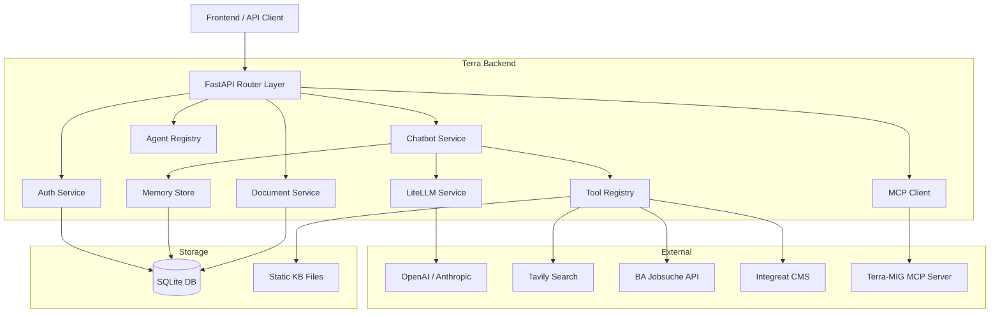

# Terra Backend

AI-powered assistant backend for migrants and newcomers to Germany. Terra combines conversational AI with specialized tools for job search, integration knowledge, visa guidance, and more.

## Quick Start

```bash
# Prerequisites: Python 3.12+, uv package manager
git clone <repo-url> && cd terra-backend

# Install dependencies
uv sync

# Configure environment
cp .env.example .env
# Edit .env — at minimum set OPENAI_API_KEY

# Run the server
uv run uvicorn terra.main:app --reload
```

The API is available at `http://localhost:8000`. Verify with:

```bash
curl http://localhost:8000/health
# {"status": "healthy"}
```

## Architecture



## Features

- **Conversational AI** — Memory-backed chatbot with automatic tool calling (max 5 rounds)
- **Session Auth** — Bcrypt password hashing, 24h session tokens, Bearer auth
- **Document Ingestion** — Upload text documents → chunked → stored in memory → available to chatbot
- **Job Search** — BA Jobsuche API integration with English→German term expansion
- **Static Knowledge Base** — 616 Integreat CMS pages across 13 categories (keyword search)
- **Web Search** — Tavily-powered web search tool
- **MCP Integration** — Model Context Protocol client for terra-mig server (visa routes, salary data, etc.)
- **Agent Framework** — Pluggable agents with tool access and configurable iteration limits
- **Multi-LLM Support** — LiteLLM abstraction supports OpenAI, Anthropic, Azure, and more

## Project Structure

```
src/terra/
├── api/              # HTTP layer (routers, endpoints, deps)
│   └── v1/endpoints/ # auth, chatbot, documents, agents, mcp, health
├── agents/           # Agent base, registry, implementations
├── tools/            # Tool base, registry, implementations
├── orchestration/    # AgentRunner, ExecutionHooks
├── mcp/              # MCP client, registry, service, tool adapter
├── llm/              # LiteLLM wrapper, config, types
├── memory/           # MemoryStore interface + DB implementation
├── services/         # Business logic (auth, chatbot, documents, search, static_kb, ba_jobs_client)
├── models/           # SQLAlchemy ORM models
├── schemas/          # Pydantic schemas (jobs, search)
├── prompts/          # Prompt template utilities
├── evals/            # Evaluation framework (base classes)
├── scripts/          # CLI scripts (fetch_static_kb)
├── db/               # Database base + session + migrations
├── config.py         # Settings (pydantic-settings)
├── setup.py          # Startup registration (tools, agents, MCP)
├── app.py            # Application factory
└── main.py           # Entrypoint
tests/
├── conftest.py       # Fixtures (in-memory SQLite, app, client)
├── fixtures/         # Test data (static_kb_sample.json)
└── test_*.py         # 11 test files, 162 tests total
```

## Technology Stack

| Layer | Technology |
|-------|-----------|
| Framework | FastAPI |
| ORM | SQLAlchemy 2.0 (async, MappedAsDataclass) |
| Database | SQLite + aiosqlite |
| Migrations | Alembic |
| LLM | LiteLLM (multi-provider) |
| Validation | Pydantic v2 + pydantic-settings |
| HTTP Client | httpx |
| Auth | bcrypt (passwords), session tokens |
| Web Search | tavily-python |
| Package Manager | uv |
| Linting | Ruff |
| Type Checking | mypy (strict) |
| Testing | pytest + pytest-asyncio |
| Container | Docker (python:3.13-slim + uv) |

## Installation

### Local Development

```bash
# Install uv if not present
curl -LsSf https://astral.sh/uv/install.sh | sh

# Clone and install
git clone <repo-url>
cd terra-backend
uv sync  # installs all dependencies including dev

# Set up pre-commit hooks
uv run pre-commit install

# Configure
cp .env.example .env
# Set at minimum: OPENAI_API_KEY (or ANTHROPIC_API_KEY)

# Fetch static knowledge base (optional, runs in background on Docker)
uv run python -m terra.scripts.fetch_static_kb

# Run
uv run uvicorn terra.main:app --reload --port 8000
```

### Docker

```bash
docker compose up --build
```

See [docs/deployment.md](docs/deployment.md) for production deployment.

## API Overview

All endpoints are under `/api/v1` unless noted. Auth endpoints return session tokens; all other endpoints (except health) require `Authorization: Bearer <token>`.

| Method | Path | Auth | Description |
|--------|------|------|-------------|
| GET | `/health` | No | Root health check |
| GET | `/api/v1/health` | No | API health check |
| POST | `/api/v1/auth/register` | No | Register user |
| POST | `/api/v1/auth/login` | No | Login |
| POST | `/api/v1/auth/logout` | Yes | Logout |
| GET | `/api/v1/auth/me` | Yes | Current user info |
| POST | `/api/v1/chat` | Yes | Send chat message |
| POST | `/api/v1/documents` | Yes | Upload document |
| GET | `/api/v1/documents` | Yes | List documents |
| GET | `/api/v1/documents/{id}` | Yes | Get document |
| DELETE | `/api/v1/documents/{id}` | Yes | Delete document |
| GET | `/api/v1/agents` | No | List agents |
| GET | `/api/v1/tools` | No | List tools |
| POST | `/api/v1/agents/run` | No | Run an agent |
| GET | `/api/v1/mcp/servers` | Yes | List MCP servers |
| GET | `/api/v1/mcp/servers/{name}` | Yes | Get MCP server |
| GET | `/api/v1/mcp/servers/{name}/health` | Yes | Check MCP health |
| GET | `/api/v1/mcp/servers/{name}/tools` | Yes | List MCP tools |
| POST | `/api/v1/mcp/servers/{name}/call` | Yes | Call MCP tool |

Full API documentation: [docs/api.md](docs/api.md)

## Documentation

- [Architecture](docs/architecture.md) — System design, data flow, component diagrams
- [API Reference](docs/api.md) — Complete endpoint documentation with examples
- [Configuration](docs/configuration.md) — All environment variables
- [Extending](docs/extending.md) — How to add tools, agents, MCP servers, etc.
- [Testing](docs/testing.md) — Test structure and running tests
- [Deployment](docs/deployment.md) — Docker, docker-compose, ECS

## Development

```bash
# Run tests
uv run pytest

# Run with coverage
uv run pytest --cov

# Lint
uv run ruff check src/ tests/

# Format
uv run ruff format src/ tests/

# Type check
uv run mypy src/
```

## Git Workflow

- `main` — Production-ready code
- `develop` — Integration branch
- `feature/*` — Feature branches (merge into develop)

## License

MIT
