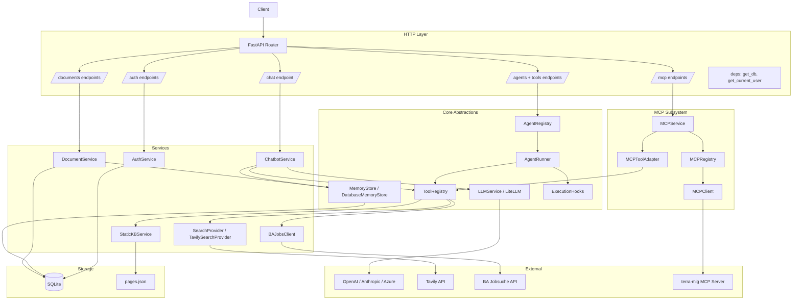
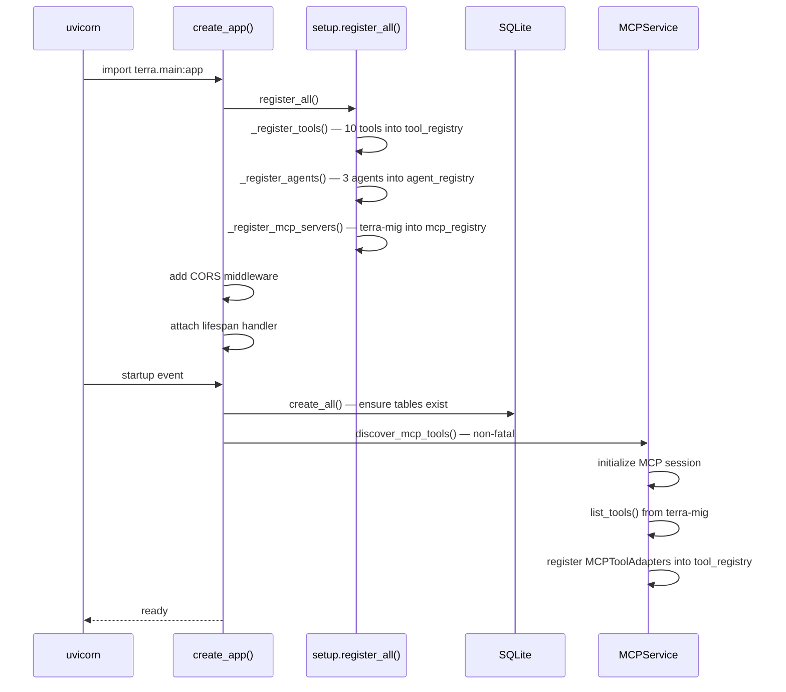
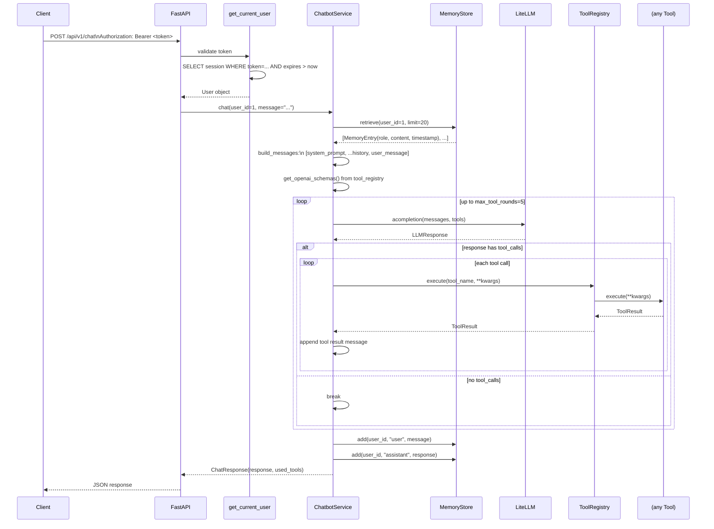
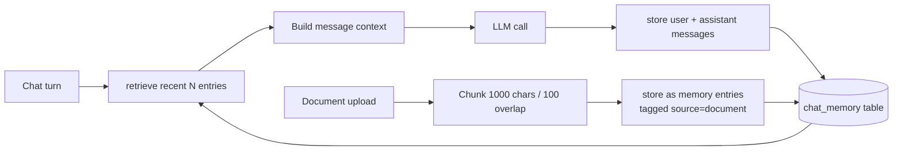
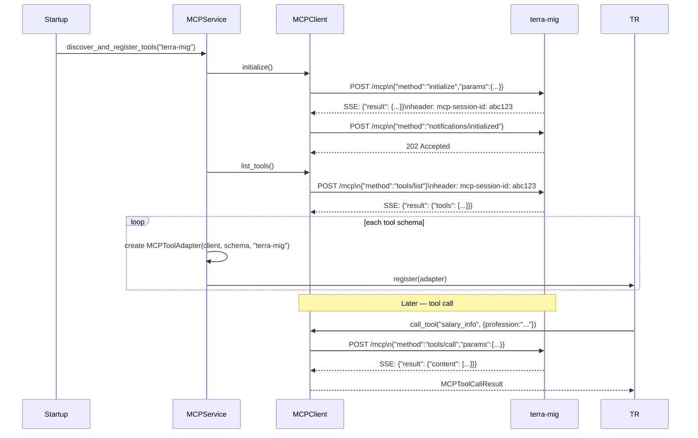
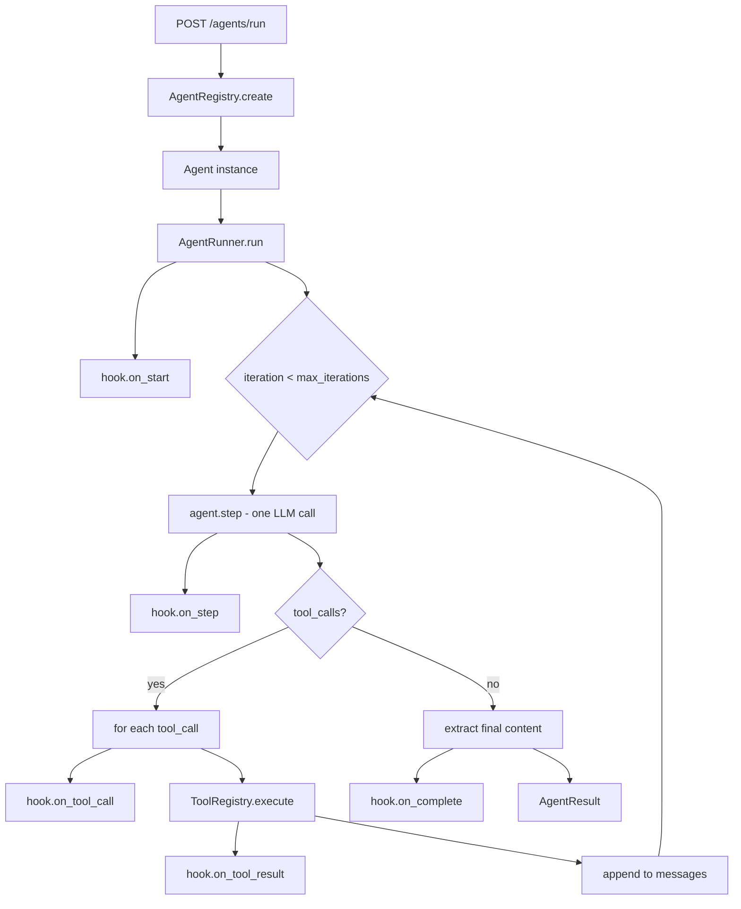
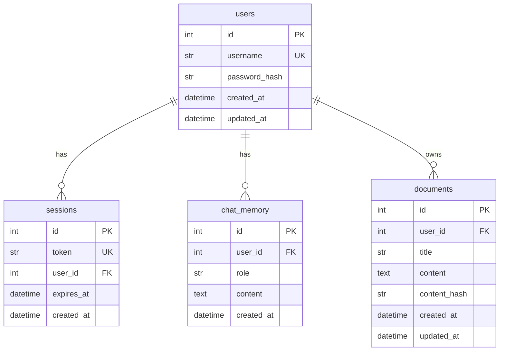
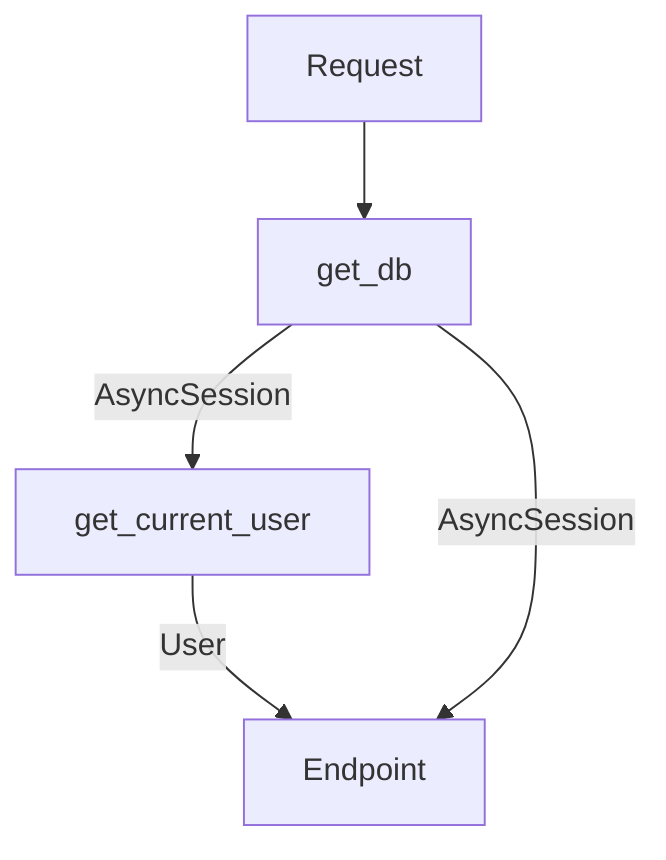

# Architecture

## Overview

Terra Backend is a FastAPI application providing a memory-backed conversational AI assistant for migrants and newcomers in Germany. It follows a layered architecture: HTTP → Services → Abstractions → External APIs.

```
HTTP (FastAPI)
    ↓
Services (ChatbotService, AuthService, DocumentService)
    ↓
Abstractions (MemoryStore, LLMService, Tool, Agent)
    ↓
Implementations (DatabaseMemoryStore, LiteLLM, ToolRegistry, AgentRunner)
    ↓
External (OpenAI, Tavily, BA API, Integreat, MCP servers)
```

---

## Component Map



---

## Startup Sequence



---

## Request Lifecycle (Chat)



---

## Tool Registration Flow

Tools are registered once at startup in `setup.py`. The global `tool_registry` singleton is used everywhere.

```mermaid
flowchart TD
    setup["setup.register_all()"]
    setup --> rt["_register_tools()"]
    setup --> ra["_register_agents()"]
    setup --> rm["_register_mcp_servers()"]

    rt --> |register| TR[tool_registry]

    rm --> |register config| MR[mcp_registry]
    MR --> |startup discover| Adapter[MCPToolAdapter per tool]
    Adapter --> |register| TR

    TR --> |get_openai_schemas()| LLM[Chatbot / AgentRunner]
    TR --> |execute(name, **kwargs)| Tools
```

---

## Memory Flow



The `MemoryStore` interface decouples the chatbot from the storage backend:

```python
class MemoryStore(ABC):
    async def add(self, user_id, role, content, metadata=None): ...
    async def retrieve(self, user_id, query=None, limit=20): ...
    async def clear(self, user_id): ...
    async def count(self, user_id): ...
```

Current implementation: `DatabaseMemoryStore` (recency-based SQLite).
Future: swap for a vector store by implementing the same interface.

---

## MCP Integration



---

## Agent Orchestration



---

## Database



---

## Dependency Injection

FastAPI dependencies flow through each request:



`get_db` yields a new `AsyncSession` per request from `async_session_factory`.
`get_current_user` resolves the Bearer token to a `User` object, raising `401` if invalid.

Both are shared across all endpoints via `Depends()`.
