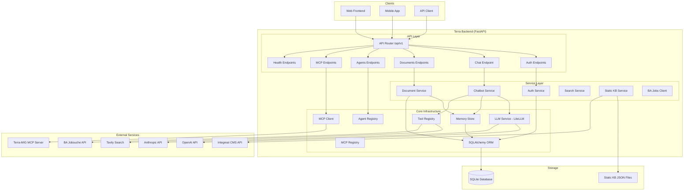
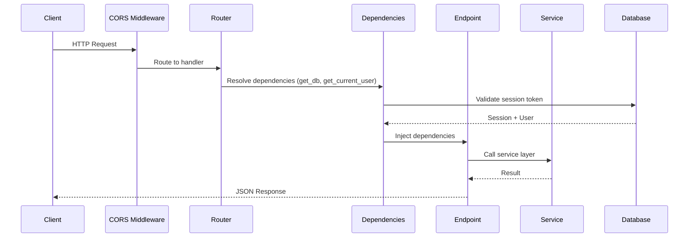
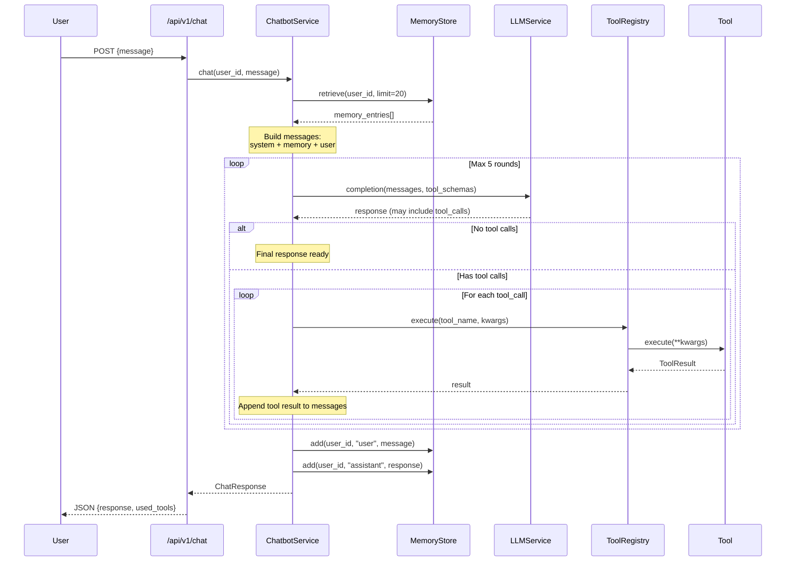
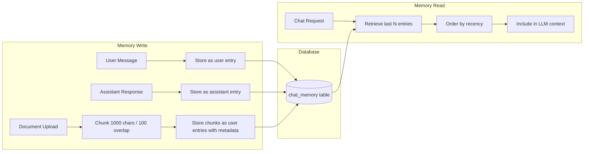
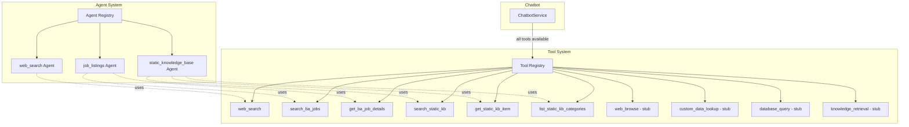
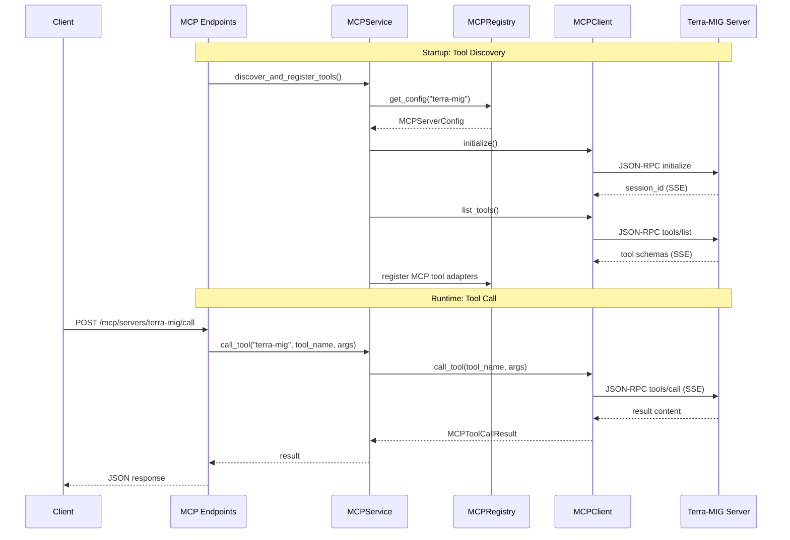
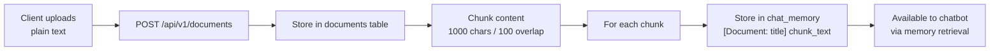
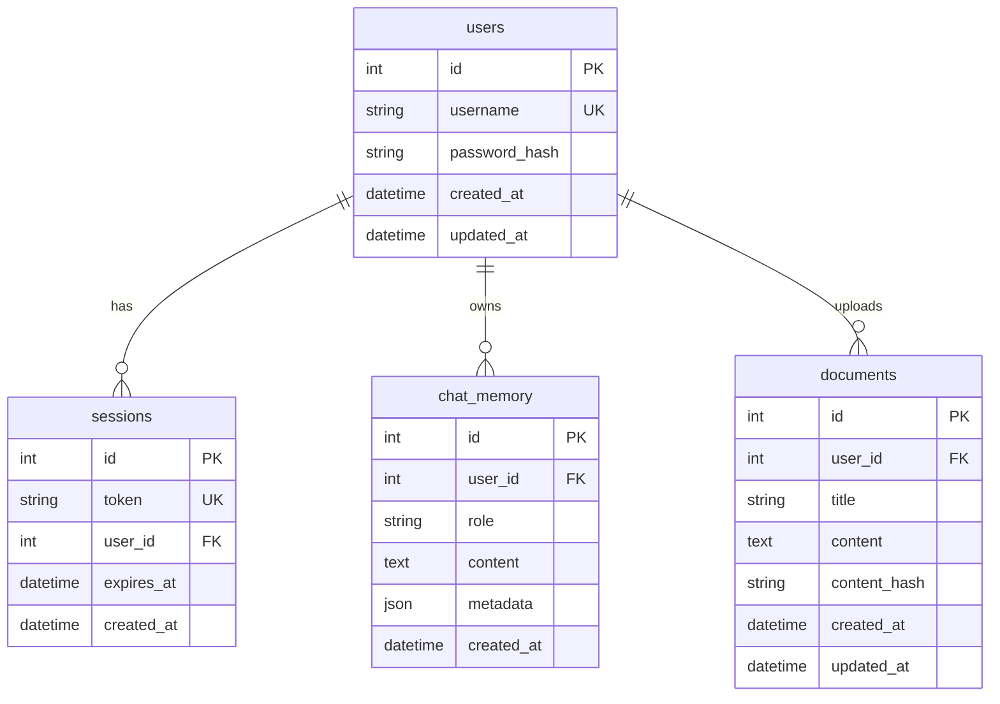
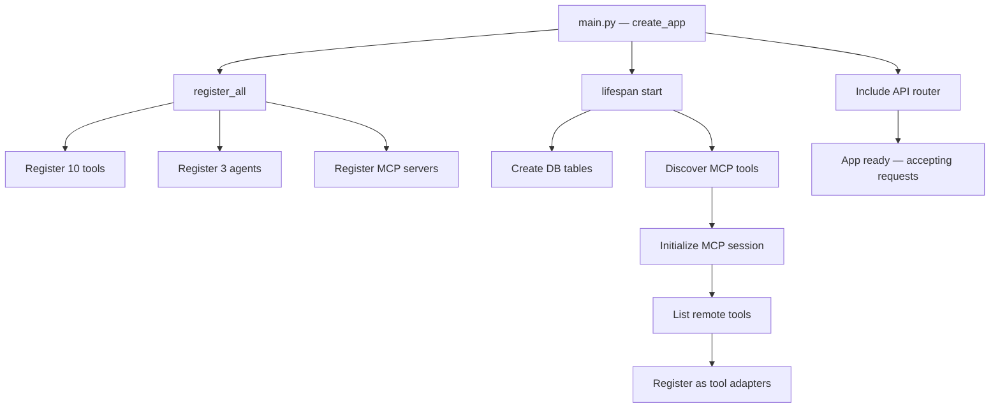

# Architecture

## Overview

Terra Backend is a FastAPI application that provides a memory-backed conversational AI assistant with pluggable tools, agents, and MCP (Model Context Protocol) integration. It is designed to help migrants and newcomers to Germany find jobs, understand visa requirements, and navigate integration resources.

## System Architecture

## Request Lifecycle

## Chatbot Orchestration Flow

The chatbot service is the core of Terra. It orchestrates memory retrieval, LLM calls, and tool execution in a loop.

## Memory Flow

## Agent / Tool Orchestration

## MCP Integration

### MCP Protocol Details

The MCP client uses **Streamable HTTP transport** (JSON-RPC over SSE):

1. **Initialize** — Establishes session, receives `Mcp-Session-Id` header
2. **Notification** — Sends `notifications/initialized` to confirm
3. **List Tools** — Discovers available tools and their schemas
4. **Call Tool** — Invokes a tool with arguments, receives structured content

The terra-mig MCP server provides 10 tools:
- `search_jobs` — Search BA job postings
- `get_job_detail` — Get full job detail by reference
- `map_profession_to_occupation` — Map free-text to KldB-2010 codes
- `get_salary_band` — Salary data for occupation codes
- `search_apprenticeships` — Vocational training offers
- `search_coaching` — AVGS coaching/activation offers
- `search_continuing_education` — Weiterbildung offers
- `query_recognition_stats` — Foreign qualification recognition stats
- `quickcheck_opportunity_card` — Chancenkarte points self-check
- `quickcheck_visa_route` — Candidate visa route suggestions

## Document Ingestion Pipeline

### Chunking Strategy

- **Chunk size:** 1000 characters
- **Overlap:** 100 characters (ensures context continuity)
- **Format:** Each chunk is stored as a memory entry with the format `[Document: {title}] {chunk_text}`
- **Retrieval:** Chunks appear in the chatbot's memory context alongside conversation history

## Database Schema

## Startup Sequence

## Key Design Decisions

1. **Async-first** — All I/O operations use async/await (SQLAlchemy async, httpx, aiosqlite)
2. **Registry pattern** — Tools, agents, and MCP servers use global registries with lazy initialization
3. **Memory as context** — Documents and conversations share the same memory system, making uploaded content automatically available to the chatbot
4. **Tool loop with cap** — The chatbot can call tools iteratively (max 5 rounds) to gather information before responding
5. **Non-fatal MCP** — MCP server discovery is best-effort; the app starts even if the MCP server is unreachable
6. **Session-based auth** — Simple Bearer tokens stored in DB; no JWT complexity needed for this use case
7. **SQLite for simplicity** — Single-file database appropriate for the current scale; easy to migrate to PostgreSQL via SQLAlchemy
