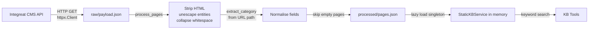

# Static Knowledge Base

The static knowledge base contains 616 pages from the [Integreat CMS](https://integreat-app.de/) covering daily life in Germany for migrants and newcomers.

---

## Source

**API:** `https://cms.integreat-app.de/testumgebung-frag-integreat/de/wp-json/extensions/v3/pages/`

The Integreat project is an open-source integration guide for migrants. The CMS exposes a public JSON API that returns all pages for a configured region.

---

## Categories (13)

| Slug | Topic |
|---|---|
| `alltag` | Everyday life |
| `angebote-für-frauen-und-mädchen` | Services for women and girls |
| `arbeit-ausbildung` | Work and vocational training |
| `beratung-und-hilfe-4` | Advice and assistance |
| `frag-integreat` | Ask Integreat |
| `gesundheit` | Healthcare |
| `info-aufenthalt` | Residence and visa information |
| `kinder-jugendliche-familie` | Children, youth, and family |
| `kultur-freizeit-sport` | Culture, leisure, sport |
| `schule-studium-bildung` | School, university, education |
| `sprache` | German language resources |
| `willkommen` | Welcome pages |
| `wohnen` | Housing |

---

## Data Files

| File | Description |
|---|---|
| `data/static_kb/raw/payload.json` | Raw JSON array from the Integreat API |
| `data/static_kb/processed/pages.json` | Normalised, searchable page list (used at runtime) |

Both files are committed to the repository. The processed file is what the application loads.

---

## Ingestion Pipeline



### `fetch_static_kb.py` steps

1. `fetch_payload()` — HTTP GET with optional Bearer auth, saves to `raw/payload.json`.
2. `process_pages()` — for each raw record:
   - Strips HTML tags from `content` field using a regex.
   - Decodes HTML entities.
   - Collapses whitespace.
   - Extracts `category` from the URL path (3rd path segment).
   - Skips records with no title and no content text.
3. `save_processed()` — writes `processed/pages.json`.

### Processed page schema

```json
{
  "id": "42",
  "title": "Healthcare for Newcomers",
  "path": "/testumgebung-frag-integreat/de/gesundheit/krankenversicherung/",
  "category": "gesundheit",
  "content_text": "Plain text content stripped of HTML...",
  "content_html": "<p>Original HTML...</p>",
  "excerpt": "Short description...",
  "url": "https://integreat.app/testumgebung-frag-integreat/de/gesundheit/krankenversicherung",
  "modified": "2025-11-01T10:00:00Z",
  "parent_id": "15",
  "languages": ["de", "en", "ar"],
  "thumbnail": ""
}
```

---

## Runtime Service

`StaticKBService` loads the processed JSON once and caches it in memory for the process lifetime.

```python
class StaticKBService:
    _instance: StaticKBService | None = None  # singleton
    _pages: list[dict] | None = None          # class-level cache

    @classmethod
    def get_default(cls) -> StaticKBService:
        # Returns singleton using STATIC_KB_PROCESSED_PATH from settings
        ...
```

### Search Algorithm

`StaticKBService.search(query, limit, category)`:

1. Tokenises the query into lowercase terms (space-split).
2. For each page (optionally filtered by category):
   - Scores: `+10` per term found in title, `+1` per term in content, `+0.5×count` bonus (up to `+5`) for repeated content matches, `+0.5` for having any content.
3. Sorts by score descending.
4. Returns the top `limit` pages.

The `SearchStaticKBTool` returns compact results (no HTML):
```python
{
    "id": ...,
    "title": ...,
    "category": ...,
    "snippet": content_text[:200],
    "url": ...,
    "path": ...,
}
```

`GetStaticKBItemTool` returns full content (plain text, not HTML):
```python
{
    "id": ...,
    "title": ...,
    "category": ...,
    "content": full_content_text,
    "url": ...,
    "path": ...,
    "modified": ...,
    "languages": [...],
}
```

---

## Refreshing the Knowledge Base

The bundled `pages.json` may become outdated as Integreat pages are updated.

### Local

```bash
uv run python -m terra.scripts.fetch_static_kb
```

Output:
```
Fetching from: https://cms.integreat-app.de/...
Saved raw payload: data/static_kb/raw/payload.json (0.8 MB)
Saved processed: data/static_kb/processed/pages.json (0.6 MB)

Summary:
  Total records: 648
  Processed pages: 616
  Pages with content: 589
  Categories: 13
  Sample categories: ['alltag', 'arbeit-ausbildung', 'gesundheit', ...]
```

### Docker

```bash
docker exec <container_name> fetch-kb
```

The Docker entrypoint checks if `pages.json` exists on startup and fetches in the background if missing.

### After Refresh

The `StaticKBService` singleton and its class-level page cache persist for the process lifetime. After refreshing the file, you must **restart the server** for changes to take effect.

---

## Configuration

| Variable | Default | Description |
|---|---|---|
| `STATIC_KB_API_URL` | Integreat CMS URL | Source API endpoint |
| `STATIC_KB_API_KEY` | — | Optional Bearer token for the API |
| `STATIC_KB_RAW_PATH` | `data/static_kb/raw/payload.json` | Where to save raw response |
| `STATIC_KB_PROCESSED_PATH` | `data/static_kb/processed/pages.json` | Where to save processed pages |
| `STATIC_KB_FETCH_TIMEOUT_SECONDS` | `60.0` | HTTP timeout for the fetch |

---

## Limitations

- **Keyword search only** — no semantic/vector search. Multi-word queries work, but synonyms and rephrasing are not handled.
- **German content** — most pages are in German. The search works with German terms.
- **Static snapshot** — content is a snapshot at fetch time, not live.
- **No incremental updates** — a full re-fetch is required to update any page.
- **In-memory only** — the full page list is held in RAM. At ~0.6 MB processed, this is negligible for the current dataset size.
